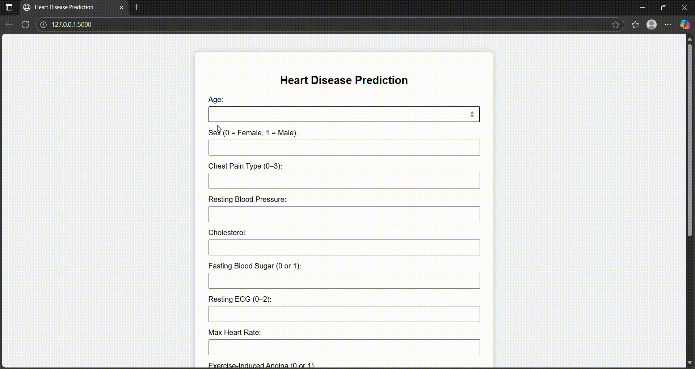

# Heart-Disease-Prediction-Web-App
This project is a machine learning-powered web application for predicting the likelihood of heart disease based on user input. It uses a trained Logistic Regression model and a Flask backend to deliver predictions through a simple and user-friendly web interface.


## Demo



## Features
- User-friendly web interface for inputting patient data
- Predicts heart disease risk using a trained ML model
- Beautiful, modern UI with centered layout and styled Predict button

## How It Works
1. User enters patient details (age, sex, blood pressure, cholesterol, etc.)
2. The app processes the input and uses the ML model to predict heart disease risk
3. The result is displayed as "High Risk" or "Low Risk"

## Technologies Used
- Python
- Flask
- scikit-learn
- HTML/CSS

## Setup Instructions
1. Clone or download this repository
2. Place your trained model file (`model_dt1.pkl`) in the project root
3. Install required Python packages:
   ```bash
   pip install flask numpy scikit-learn
   ```
4. Run the app:
   ```bash
   python app.py
   ```
5. Open your browser and go to `http://127.0.0.1:5000/`

## File Structure
- `app.py` : Flask backend and prediction logic
- `model_dt1.pkl` : Trained ML model
- `templates/index.html` : Main input form
- `templates/result.html` : Result display page
- `styles.css` : Custom styles (optional)

## Input Features
The form collects the following features:

- Age: – Age of the individual (in years)
- Sex (0 = Female, 1 = Male)
- Chest Pain Type (0–3): -(0 = Typical Angina, 1 = Atypical Angina, 2 = Non-anginal Pain, 3 = Asymptomatic)
- Resting Blood Pressure: - Blood pressure in mm Hg at rest
- Cholesterol: – Serum cholesterol in mg/dl
- Fasting Blood Sugar (0 or 1): – 0 = FBS ≤ 120 mg/dl, 1 = FBS > 120 mg/dl
- Resting ECG (0–2): – 0 to 2 (0 = Normal, 1 = ST-T wave abnormality, 2 = Left ventricular hypertrophy)
- Max Heart Rate
- Exercise-Induced Angina (0 or 1)
- Oldpeak: – ST depression induced by exercise relative to rest
- ST Slope (0–2): – 0 to 2 (0 = Upsloping, 1 = Flat, 2 = Downsloping)
- Number of Major Vessels (0–4): – Integer from 0 to 4 (number of major vessels colored by fluoroscopy)
- Thalium (0–3): – 0 = Normal, 1 = Fixed Defect, 2 = Reversible Defect, 3 = Unknown or Not Specified


## Output
- Displays whether the patient is at high or low risk of heart disease

## Author
- Manish Kumar 

## License
This project is for educational purposes.
